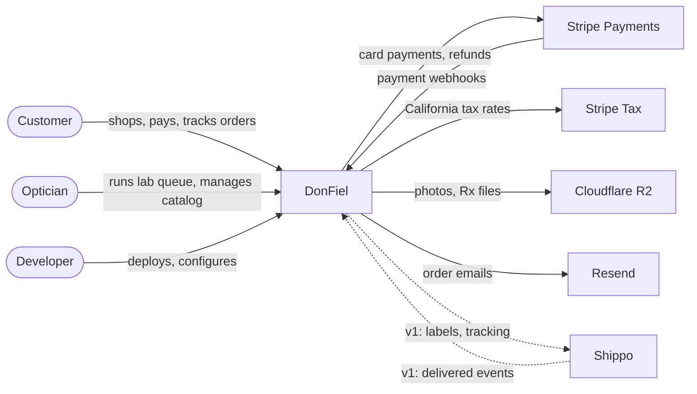
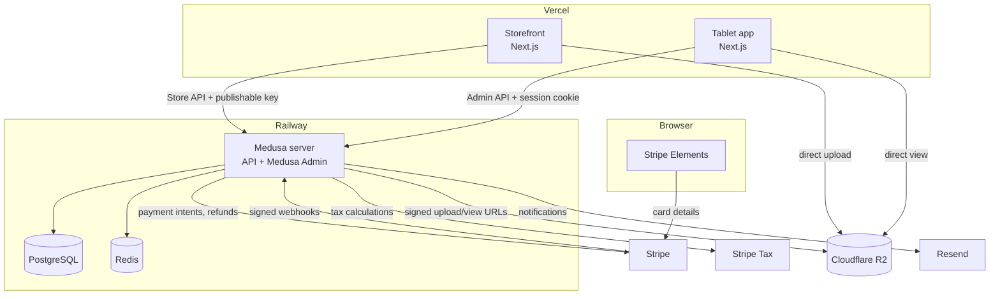
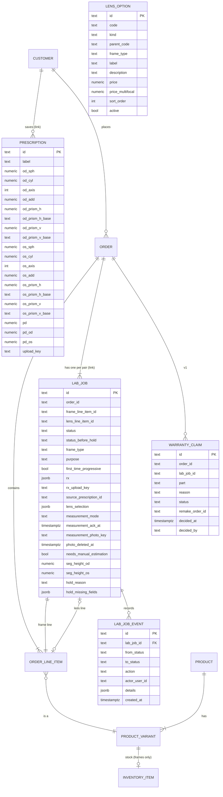
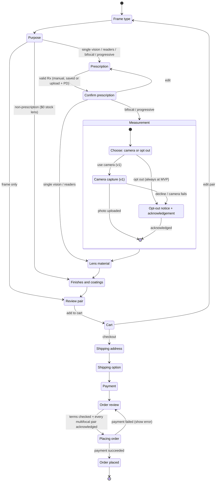
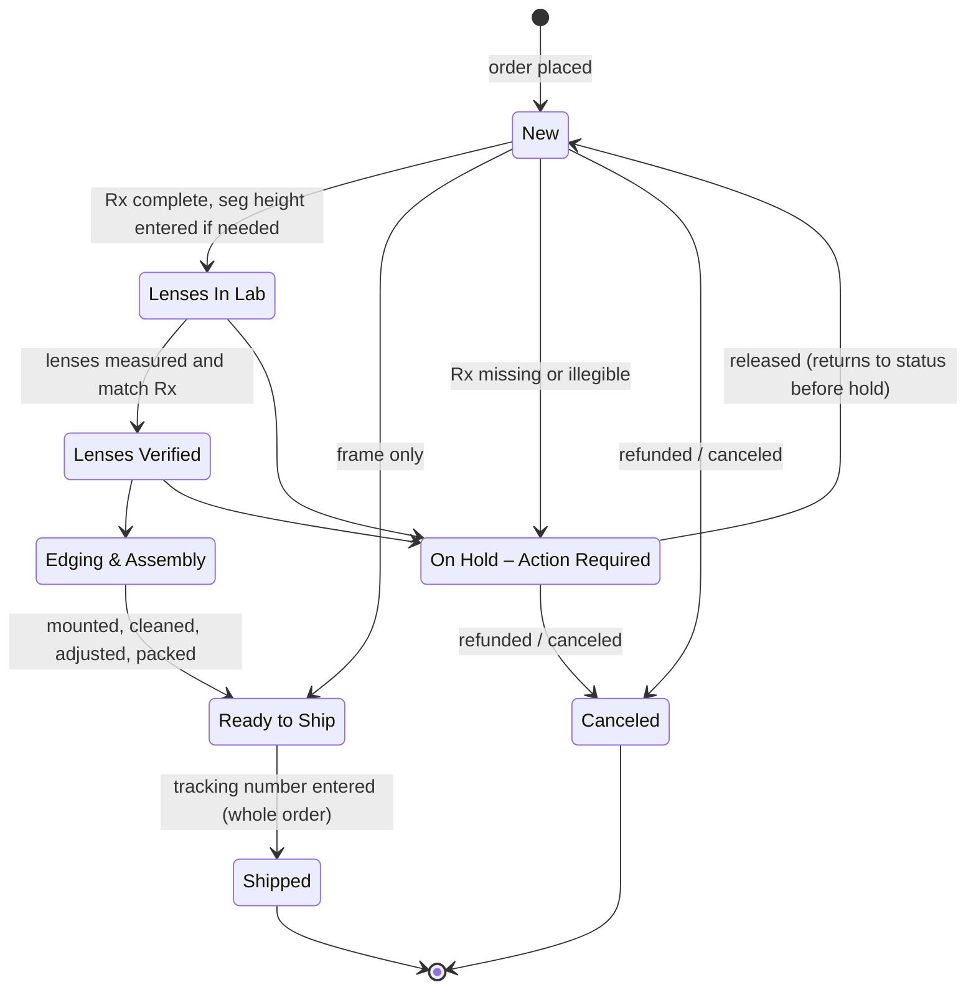
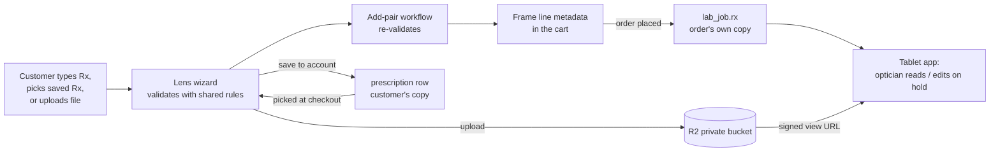
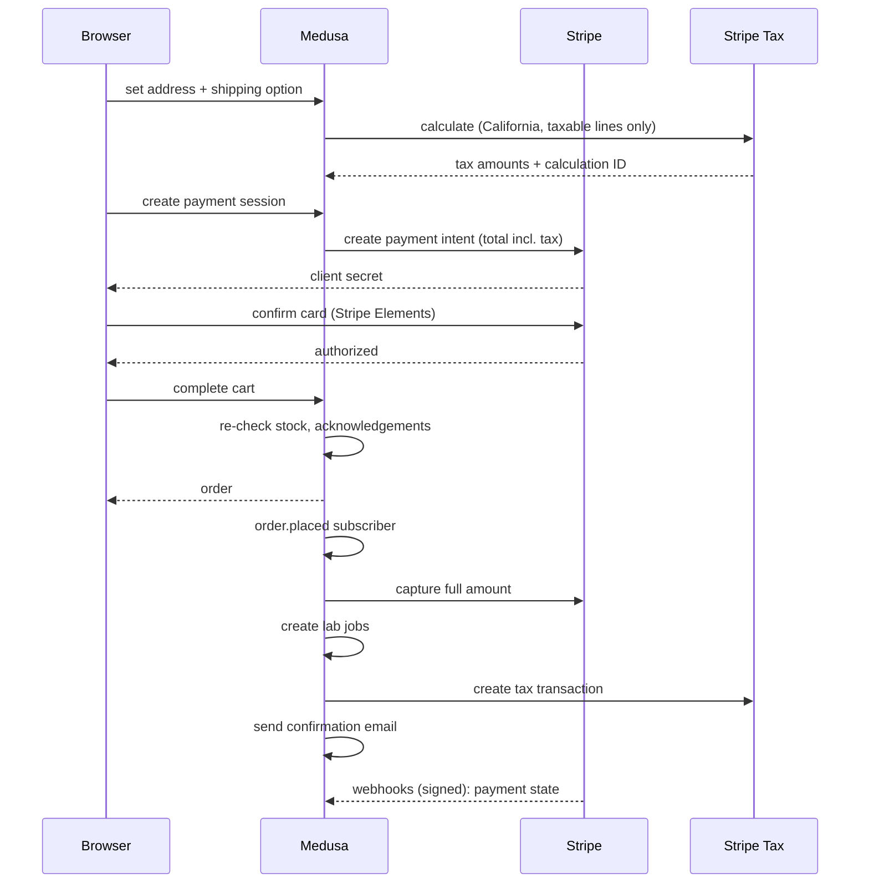

# DonFiel Project Scope

_Last updated: 2026-09-19 · Covers the MVP and v1 · Part 1: product requirements · Part 2: technical design_

This file combines the project's requirement sources into one reference:

- `DF_Customer POV.md`: what customers need to be able to do
- `DF_Lens Customization.md`: lens materials, finishes and coatings
- `DF_Website Theme.md`: visual direction
- **DonFiel Build Decisions** (doc): answers to build questions Q1–Q23 and the release plan
- **Stripe Tax vs TaxJar for DonFiel** (doc): sales tax rules and decision

`DonFiel FINAL MVP Scope.md` is a reference only. Where it disagrees with this file, this file wins. The mockups in `DF_Mockup/` show how pages should look, not which features exist.

---

# Part 1: Product Requirements

## 1. Who is the product for?

**The business.** DonFiel is a small eyewear business run by a California registered optician, with no internet presence today. It sells its own frames and makes every prescription pair in our lab.

**Customers** (U.S. only):

| Customer | What they need |
| --- | --- |
| Guest shopper | Browse and buy without creating an account |
| Style-focused mobile shopper | Clean visuals, fast pages on a phone, easy color comparison |
| Non-prescription buyer | Sunglasses, fashion frames or a bare frame, without medical forms |
| Prescription buyer | A calm, step-by-step way to enter an Rx without being overwhelmed by OD/OS/CYL values |
| Progressive or bifocal buyer | A way to supply seg height, or a clear explanation of what happens if they don't |
| Returning customer | Saved prescriptions and quick reordering of a new or backup pair |

**Operators:**

| Operator | What they need |
| --- | --- |
| Optician (the client) | A tablet dashboard beside the lab equipment to run orders, plus desktop access to manage the catalog and stock. Never sees code, API keys or global settings |
| Developer | Full access to settings, keys, deployments and integrations |

## 2. What problems does it solve?

1. **No online presence.** Customers can't find or buy from the business online. DonFiel gives them a storefront that works on any device.
2. **Prescription ordering is intimidating.** Dense forms full of optical terms make buyers give up. DonFiel guides them one step at a time, shows only the fields their lens type needs, and lets them upload a photo of their Rx instead of typing it.
3. **Multifocal lenses need a measurement customers can't take themselves.** DonFiel lets customers send a photo with a reference card so the optician can measure seg height. Customers who don't want to share a photo can opt out, and the optician estimates it instead.
4. **The optician has no system for tracking lab work.** DonFiel gives the optician a tablet queue with lab stages, an On Hold state for incomplete prescriptions, and refunds they control.
5. **Selling online brings compliance work.** DonFiel handles California sales tax per line item, publishes return, privacy and terms policies, and enforces return and warranty windows.
6. **Customers want to know where their order is and what they're owed.** DonFiel gives order confirmations, order history with status, clear delivery estimates, and a self-service returns and warranty path.

## 3. What does the product do?

DonFiel is an online eyewear store with an optician's dashboard. It:

- Shows a catalog of 5 frame styles in 20 colors, with photo galleries that change with the selected color and live stock status
- Sells each frame as eyeglasses or sunglasses, with or without prescription lenses, or as a bare frame
- Guides customers through lens choices: purpose, prescription, lens material, finishes and coatings
- Collects prescriptions by upload, manual entry, or a saved prescription, with field rules that match the lens type
- Offers a camera step for seg height (v1), or an opt-out that sends the order to the optician for estimation
- Takes card payment, charges California sales tax correctly, and offers standard or expedited shipping
- Gives customers accounts with saved, named prescriptions and order history
- Gives the optician a tablet queue that follows each pair through our lab, from new order to shipped
- Handles returns within 14 days and warranty claims within 60 days (Rx lenses) or 1 year (frames)

---

## 4. Releases

| Release | Target | Contents |
| --- | --- | --- |
| MVP | Monday, November 16, 2026 | Everything needed to sell prescription glasses (build steps 1–6) |
| v1 | End of 2026 | Camera measurement step, self-service returns and warranty portal, admin security polish, a practice site (build steps 7–8) |

**Build order:** 1. Catalog → 2. Cart → 3. Non-Rx checkout with live payments → 4. Rx checkout → 5. Accounts and saved prescriptions → 6. Tablet admin → 7. Camera step → 8. Returns and warranty portal.

Each requirement below is tagged **[MVP]** or **[v1]**.

**Done by hand at MVP**, until v1 replaces it:

- Shipping labels are bought outside the site, and the tracking number is entered in the admin
- Returns and warranty claims are handled by email, and the optician refunds from the dashboard
- The optician rehearses on the live site in payment test mode before real payments are switched on

**Not in this document's scope:**

- **v2** (end of 2026 or January 2027): account closure requests handled by staff; launching the admin from a tablet home-screen icon; an upload link for missing Rx information
- **Backlog:** automatic prescription reading (OCR); 3D face measurement; live camera try-on for browsing; automatic seg height calculation; hiding frames too short for progressive lenses; made-to-measure frames; syncing stock with the frame supplier; shipping priced by package size; international shipping
- **Decided against:** rush processing; checking whether a prescription is still valid; holding refund money in escrow; a self-service "delete my account" button

---

## 5. Launch catalog

Five styles, named with Portuguese numbers, in 20 colors.

| Style | Colors | Count |
| --- | --- | --- |
| Um | Champagne, Turquoise, Black | 3 |
| Dois | Turquoise/Clear two-tone | 1 |
| Três | Gradient, dark blue to sky blue | 1 |
| Quatro | Frosted Matte Clear, Dark Turquoise, Black, Frosted Yellow, Frosted Orange, Frosted Red, Frosted Pink, Frosted Blue | 8 |
| Cinco | Frosted Matte Clear, Black, Frosted Yellow, Frosted Orange, Frosted Red, Frosted Pink, Frosted Blue | 7 |

**Frame prices** (the frame alone; lenses are priced separately):

| Style | Regular price | Discounted price |
| --- | --- | --- |
| Um | $260 | $120 |
| Dois, Três, Quatro, Cinco | $220 | $100 |

- Customers pay the discounted price. The regular price is shown crossed out next to it.
- Every frame can be bought as eyeglasses or sunglasses.
- The five colors made from the frosted matte clear are named "Frosted <color>" (handles such as `frosted_yellow`), so they aren't confused with the Tinted lens finish.
- Only frames are stock. Each order takes one frame out of inventory. Lenses are made per order in our lab.
- The `seis`, `sete` and `DO NOT ADD` photo folders are not part of the launch catalog.

---

## 6. Storefront

- **[MVP]** Browse the storefront and the full catalog.
- **[MVP]** Works on desktop, tablet and phone, with a menu for small screens and an "Add to Cart" bar that stays visible on phones.
- **[MVP]** Product page for each style with a photo gallery showing several angles.
- **[MVP]** Choosing a color swaps the photos instantly, so customers can compare colors before customizing lenses.
- **[MVP]** Each color shows whether it's in stock. At zero stock, "Add to Cart" is disabled and an out-of-stock state is shown.
- **[MVP]** Cart showing frame, color, lens material and add-ons, with the ability to edit or remove items before paying.

---

## 7. Checkout and lens customization

### Steps

1. **Frame type:** eyeglasses or sunglasses. All frames are eligible for both.
2. **Purpose:** single vision, bifocal, progressive, readers, non-prescription, or frame only (no lenses). Readers requires an Rx. Progressive buyers can tell us they're first-time progressive users.
3. **Prescription:** pick a saved prescription, type one in, or upload a photo or PDF. Customers are encouraged to upload an Rx that shows a license number.
4. **Confirm prescription:** review the values entered, with a way back to edit them.
5. **Measurement [v1]:** the optional camera step (section 9). At MVP, progressive and bifocal orders go straight to manual estimation.
6. **Lens material:** required choice of material for prescription lenses. Non-prescription pairs get a $0 stock lens and skip this step.
7. **Finishes and coatings:** optional add-ons.
8. **Order review:** every choice made; the measurement acknowledgement where it applies; shipping details; card payment; the required terms checkbox; "Place order".

**Branches:**

- Non-prescription orders skip steps 3–6.
- Frame-only orders skip steps 3–7 and ship straight from stock.

### Lens materials

Required on every prescription order. The same four options apply to eyeglasses and sunglasses, and the price depends on the lens type.

| Material | Description | Single vision / readers | Bifocal / progressive |
| --- | --- | --- | --- |
| CR-39 | Plastic, entry level. The most affordable; good for low prescriptions | +$20 | +$80 |
| Polycarbonate | Thinner than CR-39 and highly durable. The usual choice for higher prescriptions, where CR-39 gets thick | +$35 | +$110 |
| High Index | Thinner than Polycarbonate | +$45 | +$150 |
| Tryvex | About twice as durable as Polycarbonate | +$55 | +$180 |

**Non-prescription lenses** are stock lenses at $0, with no material choice. The customer pays only for the finish and coatings they pick.

### Finishes (optional; depend on frame type)

| Frame type | Finish | Price | Sub-options |
| --- | --- | --- | --- |
| Eyeglasses | Clear | +$0 | None |
| Eyeglasses | Transition | +$60 | Grey or brown |
| Sunglasses | Gradient tint | +$30 | 8 tint colors |
| Sunglasses | Solid tint | +$20 | 8 tint colors |
| Sunglasses | Polarized | +$80 | Brown, gray, or G15 (green) |

**Tint colors** (same for gradient and solid): Grey, Brown, Green, Red, Pink, Yellow, Orange, Purple.

_To confirm: whether tint density (1, 2 or 3) is still offered._

### Coatings (optional)

| Coating | Price | Fits |
| --- | --- | --- |
| Anti-reflective | +$50 | Eyeglasses and sunglasses |
| Premium blue light filter anti-glare | +$80 | Eyeglasses and sunglasses |
| Solid mirror | +$60 | Sunglasses only |
| Flash mirror | +$50 | Eyeglasses only |

**Mirror colors** (same for solid and flash): Blue, Green, Silver, Black, Cobalt, Gold (+$20 extra), Orange, Red, Pink.

_To confirm: which coatings can be combined, for example anti-reflective together with the blue light filter, or a mirror with anti-reflective._

### Pricing

- The lens is priced separately from the frame and appears as its own line.
- Prescription lens price = material (by lens type) + finish + each coating + $20 if the mirror color is Gold. Prices are flat add-ons and don't change with prescription strength.
- Non-prescription lens price = $0 stock lens + finish + each coating (+ $20 for Gold).
- Example: progressive, Polycarbonate, Transition, anti-reflective = $110 + $60 + $50 = $220 for the lens, plus the frame.

---

## 8. Prescriptions

### Fields

For each eye (OD and OS): SPH, CYL, Axis, ADD, horizontal prism and vertical prism. For the order: PD, and seg height for multifocals.

| Field | Rule |
| --- | --- |
| PD | **[MVP]** Required on every Rx order. One value (63) or two (31/32). A helper explains how to measure it |
| Axis | **[MVP]** Appears and becomes required only when CYL has a value. Range 0–180 |
| ADD | **[MVP]** Required for progressive and bifocal only |
| Seg height | **[MVP]** Progressive and bifocal only. Entered by the optician when the order is flagged for manual estimation |
| Horizontal prism | **[MVP]** When an amount is entered, a base direction is required: base in or base out |
| Vertical prism | **[MVP]** When an amount is entered, a base direction is required: base up or base down |

One eye can have both a horizontal and a vertical prism (for example, 1 base up and 1 base out). Prism orders are rare.

### Saving and reusing

- **[MVP]** Every Rx order keeps its own copy of the prescription, and of any uploaded file, on that pair's line. An order can hold several pairs, and each pair keeps its own prescription (for example, a distance pair and a pair of readers in one checkout). For guests, this is the only copy.
- **[MVP]** Account holders can save multiple prescriptions, name them, update them when their prescription changes, and pick one at checkout.
- **[MVP]** A prescription typed in at checkout can be saved to the customer's account.
- **[MVP]** The prescription picked at checkout is copied onto the order. Editing a saved prescription later never changes a past order.
- **[MVP]** When the optician gets missing information during an On Hold, they update the order's copy. The customer's saved prescription changes only if the customer edits it.

---

## 9. Measurement step and opting out

- **[v1]** Customers buying progressive or bifocal lenses can measure their optical center and seg height with the camera, holding a standard-sized reference card.
- **[v1]** The site captures the photo only. The optician measures from it by hand.
- **[v1]** A privacy notice in the camera step says where the photo goes (our lab only, never sold) and that it is deleted automatically 14 days after delivery.
- **[MVP]** Opting out is always available and never stops checkout. At MVP, before the camera step exists, every progressive and bifocal order follows this path.
- **[MVP]** An opted-out order is flagged for manual estimation by the optician.
- **[MVP]** The customer sees what opting out means: a standard measurement will be used, and a minor adjustment may be needed on delivery.
- **[MVP]** A required checkbox, confirming the customer understands this, gates "Place order".
- The warranty is the same whether the customer uses the camera or opts out.

---

## 10. Customer accounts

- **[MVP]** Guests can check out without an account.
- **[MVP]** Sign up, log in and log out.
- **[MVP]** Edit account details: name, email, shipping address and password.
- **[MVP]** Save, name, update and reuse prescriptions (section 8).
- **[MVP]** View current and past orders, with each order's current status.
- **[v1]** Save payment methods.
- Account closure is v2 and outside this document. It will be request-based, handled by staff.

---

## 11. Orders, delivery and payment

### Delivery estimate

- **[MVP]** Order placed to delivered = lab time for the lens type + 1 business day of optician work + shipping transit time.

| Lens type | Lab time, order to lenses ready |
| --- | --- |
| Progressive | 5 business days |
| Bifocal | 3 business days |
| Single vision or readers | 1 business day |
| No Rx, with a finish or coating | 1 business day |
| Frame only | None; ships straight from stock |

### Shipping

- **[MVP]** U.S. only.
- **[MVP]** Customers enter and confirm their shipping address at checkout.
- **[MVP]** Two options: standard shipping, or expedited shipping at the customer's cost. There is no rush processing.
- **[MVP]** At MVP, labels are bought by hand and the tracking number is entered in the admin.
- **[v1]** Labels are bought from inside the admin.
- **[v1]** The delivery date is recorded automatically from the carrier. It starts the return and warranty clocks.

### Payment

- **[MVP]** Card payment. The site never stores card numbers itself.
- **[MVP]** The card is charged in full at checkout, before any lens work starts in our lab.
- **[MVP]** "Place order" shows a loading state and is disabled while payment processes, so customers can't be charged twice. Messages confirm success or explain a failure.
- **[MVP]** A confirmation page shows the order number and confirmation email, sets delivery expectations, and clears the cart.
- **[MVP]** Refunds are never automatic. Only the optician issues a refund, from the dashboard. This covers stock-outs, defects, cancellations and returns.
- **[v1]** Repeated failed payments from the same source are blocked, to stop card-testing bots.

---

## 12. Returns and warranty

| Window | Starts at | Covers |
| --- | --- | --- |
| 14 days | Delivery | Return of the whole order |
| 60 days | Delivery | Warranty on prescription lenses |
| 1 year | Delivery | Warranty on frames |

- The warranty comes with every order, whether or not the customer used the camera step.
- The customer pays return shipping, and its cost is taken off the refund.
- **[MVP]** Returns and warranty claims are handled by email. The optician refunds from the dashboard after inspecting the returned glasses.
- **[v1]** Returns portal: guests find their order with the order number and email; account holders start from order history.
- **[v1]** Within 14 days, the portal issues a return label.
- **[v1]** After 14 days, the return option is disabled and an expiry notice explains why.
- **[v1]** Warranty claim form, available within the warranty windows, which goes to the optician for review.
- **[v1]** Approved warranty claims become a $0 remake order, with the claim reason recorded.

---

## 13. Sales tax

- Collected in California only. The client is a registered optician with a California seller's permit.
- Calculated from the buyer's shipping address.

| Line | Shipped to California | Shipped elsewhere |
| --- | --- | --- |
| Frame (Rx or non-Rx order) | Taxable | No tax |
| Prescription lens | Not taxable | No tax |
| Non-Rx lens, finish or coating | Taxable | No tax |
| Shipping (standard or expedited) | Not taxable | No tax |

If sales into another state pass that state's threshold, the client will need to register there too. The tax service tracks these thresholds.

---

## 14. Tablet admin and order workflow

### How a pair is made in our lab

1. Order received
2. Optician reads the Rx. If information is missing or illegible, the order goes On Hold
3. Pull the frame from inventory
4. Send the Rx to our lab
5. Lenses ready: measure and verify the Rx
6. Edge the lenses to fit the frame
7. Mount the lenses; verify axis and seg height
8. Ultrasonic clean, wash with soap and water, wipe dry
9. 4-point adjustment
10. Case, cleaning cloth, box and label
11. Ready to ship

### Admin requirements

- **[MVP]** Separate logins for the optician and the developer. The optician cannot see API keys or global store settings.
- **[MVP]** An order queue with these statuses: New → Lenses In Lab → Lenses Verified → Edging & Assembly → Ready to Ship → Shipped, plus On Hold – Action Required.
- **[MVP]** A way to put an order On Hold. This sends an automated email asking the customer for the missing or illegible information. The customer replies by email, and payment stays captured while the order waits.
- **[MVP]** A queue of orders flagged for manual seg height estimation, with a seg height entry field.
- **[MVP]** The tablet app works and is optimized on phone, tablet and desktop.
- **[MVP]** An Rx view with large, readable values and large touch targets, usable on a tablet beside the lab equipment.
- **[MVP]** A tracking number entry when an order ships.
- **[MVP]** A refund button.
- **[MVP]** Automatic logout after a period of inactivity.
- **[MVP]** Desktop management of the catalog, colors, photos and stock counts.
- **[v1]** A PIN lock screen when the tablet wakes.
- **[v1]** A "Continue working" warning before automatic logout.
- **[v1]** A warning before leaving a page with unsaved changes.
- **[v1]** Warranty claims and return approvals handled in the dashboard.
- **[v1]** A separate practice site with sample orders, so the optician can rehearse without touching live orders or payments.

---

## 15. Customer communication

- **[MVP]** Emails: order confirmation, the On Hold request for missing Rx information, and shipping with tracking.
- **[v1]** Emails: return label.
- **[MVP]** A contact page or support email link, so customers can ask questions before or after buying.

---

## 16. Legal and privacy

- **[MVP]** Terms of service, privacy policy and return policy pages. These must be published before real payments can be accepted.
- **[MVP]** A required terms checkbox before payment.
- **[MVP]** A cookie consent banner.
- **[MVP]** The privacy policy states that the site collects a photo, not biometric data, and states that it is deleted automatically 14 days after delivery.
- **[MVP]** The terms and return policy state the 14-day return window and the warranty (60 days on Rx lenses, 1 year on frames), which applies the same whether or not the camera step was used.

---

## 17. Quality requirements

- **[MVP]** Every page works on phone, tablet and desktop.
- **[MVP]** Pages load quickly on a cellular connection, including photo-heavy ones.
- **[MVP]** The checkout steps and every pop-up can be used with only a keyboard (Tab and Enter) and with a screen reader.
- **[MVP]** Clear empty states, for example an empty cart or no orders yet, instead of blank screens.
- **[MVP]** A custom "page not found" with a way back to the catalog, and a friendly error page instead of a crash.
- **[MVP]** Pages are findable by search engines, and shared links show a proper title and description.

---

## 18. Design direction

- **New York abstract:** simple, almost like art. People may not fully understand it, but it looks good.
- **Like an art gallery:** mostly empty space, with color used carefully.
- **Colorful but not saturated:** some areas bright, others quiet. Brights such as orange and green are muted.
- **Minimal layout.**
- **Palette:** gold (orange/yellow/gold), black, white and grey, plus muted accent colors.
- `DF_Mockup/` guides layout, visual design, copy tone and field naming.

---

## 19. Wording rules

- **Our lab:** describe all lens work as done in-house in our lab. Never say an outside or third-party lab, and never say lenses are ordered from or picked up at a lab.
- **Warranty:** the warranty is included with every order. Don't use "coverage" or "protection" in a way that suggests it's optional or can be bought. The last checkout step is "Order Review".
- **Frosted colors:** use "Frosted <color>" for the five colors made from the frosted matte clear, never "tint".

---

## 20. Open items

| Item | Needed by | Why |
| --- | --- | --- |
| Domain (for example donfiel.com) | Oct 9, 2026 | Payment account review, order emails and site security all need it |
| Standard and expedited shipping prices | Oct 30, 2026 | End-to-end testing needs real totals |
| Price list details: whether tint density (1, 2, 3) is still offered, and which coatings can be combined | Oct 2, 2026 | Needed before the cart and lens steps are built |
| Stock count and photos for each of the 20 colors (Cinco has no photos yet) | Nov 2, 2026 | Loading the real catalog |

---

# Part 2: Technical Design

_Covers the MVP and v1, like Part 1. Section numbers continue from Part 1._

**Diagrams in this part:**

| Diagram | Section | Origin |
| --- | --- | --- |
| Checkout wizard state machine | 25.1 | Requested |
| Context diagram | 23.1 | Suggested in the request |
| Project structure | 23.4 | Suggested in the request |
| CRC cards | 23.3 | Suggested in the request |
| Rx data flow | 26.4 | Suggested in the request |
| Component diagram (how the parts connect) | 23.2 | **Added by Claude:** the request asked how the key components interact, and a diagram shows that faster than prose |
| Database schema (ER diagram) | 24.2 | **Added by Claude:** drawn as a diagram so the links between Medusa's tables and ours are visible |
| Lab job state machine | 25.2 | **Added by Claude:** the tablet statuses have rules (what can follow what, what blocks a move), and they need a diagram as much as checkout does |
| Place-order sequence | 27.3 | **Added by Claude:** payment, tax and webhooks happen in a strict order across four systems. This is the flow most likely to cause double charges or wrong tax if built out of order |

---

## 21. Tech stack

### Decided

| Layer | Choice | Notes |
| --- | --- | --- |
| Storefront | Next.js (App Router) + React + Tailwind CSS | Hosted on Vercel |
| Backend | MedusaJS v2 (Node.js + TypeScript) | Hosted on Railway |
| Database | PostgreSQL | Railway, with daily backups turned on |
| Tablet admin | Separate Next.js app | Hosted on Vercel. Talks to Medusa's admin API |
| Desktop admin | Medusa Admin (built in) | Served by the Medusa server at `/app` |
| Payments | Stripe, through Medusa's official Stripe payment provider | Card form is Stripe Elements |
| Transactional email | Resend | Through a Resend provider for Medusa's Notification module |
| Sales tax | Stripe Tax, Tax Basic (pay-as-you-go) | Through a custom Medusa tax provider (section 26.2) |
| Shipping labels | Shippo | By hand at MVP; from the admin in v1 |
| File storage | Cloudflare R2 | Product photos, Rx uploads, measurement photos (v1) |
| Source control | GitHub organization owned by the business | Private repo. DonFiel email as an owner; the developer's personal account invited as a second owner |
| Hosting accounts | Vercel (Pro) and Railway, owned by the business | Vercel's free Hobby plan is for non-commercial use, and this is a store |

### Proposed in this design

These close gaps in the stack. Each one is the smallest option that meets the requirements, and any of them can be overruled.

| Layer | Proposal | Why |
| --- | --- | --- |
| Storefront base | Start from Medusa's official Next.js starter | It already includes the catalog, cart, checkout, customer accounts and Stripe. With the Nov 16 date, the work goes into the lens wizard, not rebuilding a store |
| Cart state | Cart lives in Medusa, found through a cookie holding the cart ID (how the starter works) | Replaces the scope's "React Context or Zustand." The server cart is the source of truth, so no client cart store is needed |
| Wizard state | A React reducer whose transitions match the state machine in 25.1, saved to `sessionStorage` | A refresh doesn't lose the customer's progress. No state-machine library needed for about 12 states |
| Repo layout | One repo with pnpm workspaces: `apps/backend`, `apps/storefront`, `apps/lab`, `packages/eyewear` | The Rx rules, lens option codes and delivery estimate are needed by all three apps. A shared package keeps them identical |
| Validation | Zod | Medusa already uses Zod for API route validation, so the storefront, tablet app and backend share the same Rx schema |
| Dates | date-fns with `@date-fns/tz` | Replaces the scope's "date-fns or dayjs." Handles business days and the America/Los_Angeles timezone |
| Redis | Railway Redis, for Medusa's event bus, workflow engine and locking | Medusa recommends Redis in production. Order-placed events and scheduled jobs depend on it |
| Tablet login | Medusa session cookies (not tokens in browser storage) | `lab.donfiel.com` and `api.donfiel.com` share a parent domain, so a secure, HTTP-only cookie works and scripts can't read it |
| Fulfillment at MVP | Medusa's manual fulfillment provider, with two flat-rate shipping options | Matches "labels bought by hand." Shippo comes in v1 |
| Tests | Vitest for `packages/eyewear`; Medusa's own test tools (Jest-based) for the backend; Playwright for three checkout paths | Section 22.6 |
| CI | GitHub Actions: lint, type-check and test on every pull request | Free for private repos within GitHub's included minutes |

### Deliberately left out

| Tool | Why not now |
| --- | --- |
| Error tracking service (for example Sentry) | Railway and Vercel logs are enough at launch volume. Add it if errors become hard to trace |
| Turborepo or Nx | pnpm workspaces alone handle three apps and one package |
| XState or another state-machine library | The wizard has about 12 states; a reducer with a transition table covers it |
| A separate Medusa worker instance | One Medusa instance in "shared" mode handles both API calls and background jobs at this volume. Split it if background jobs slow down the API |
| Staging environment | v1. At MVP, the optician rehearses on production in Stripe test mode before live keys are turned on |
| Face-API.js / MindAR | The camera step only takes a photo. Nothing is measured in the browser |
| TaxJar, EasyPost | Replaced by Stripe Tax and Shippo |

---

## 22. Engineering requirements

### 22.1 Performance

- **ER-1** Storefront pages meet Google's "good" Core Web Vitals on a mid-range phone over 4G: Largest Contentful Paint under 2.5 s, Cumulative Layout Shift under 0.1, Interaction to Next Paint under 200 ms.
- **ER-2** Every product photo goes through `next/image`: resized per screen, served as WebP or AVIF, lazy-loaded below the fold, with fixed dimensions so nothing shifts.
- **ER-3** Catalog and product pages are rendered on the server and cached, then refreshed when products change. Stock status is fetched fresh.
- **ER-4** Switching colors on a product page swaps images on the client with no page load. The images for every color are listed in the page data, and the first image of each color is preloaded.

### 22.2 Accessibility

- **ER-5** Target WCAG 2.1 AA.
- **ER-6** Every wizard step, radio card, add-on toggle and pop-up works with Tab, Shift+Tab, Enter, Space and Escape. Custom controls carry `aria-label`s.
- **ER-7** When a wizard step changes, focus moves to the new step's heading. Pop-ups trap focus and return it to the button that opened them.
- **ER-8** Form errors are announced to screen readers and linked to their fields.

### 22.3 Security

- **ER-9** Card numbers never touch DonFiel's servers. Stripe Elements collects them, which keeps PCI scope at its lowest level (SAQ A).
- **ER-10** No secrets in the repo. `.env*` files are in `.gitignore`, and production keys are set in Railway and Vercel only.
- **ER-11** Stripe webhooks are verified with the webhook signing secret before anything changes. Medusa's Stripe provider does this. Shippo webhooks (v1) are verified the same way.
- **ER-12** All traffic is over HTTPS. CORS allows only the storefront, tablet app and Medusa Admin origins.
- **ER-13** The optician's login can reach the tablet app and Medusa Admin. It has no access to Railway, Vercel, GitHub, or the Stripe developer settings. Every API key lives in environment variables, which neither admin interface can show. Medusa Admin has no built-in roles, so this separation comes from account access, not from permissions inside Medusa.
- **ER-14** Custom admin routes check the user's role (`user.metadata.role` is `optician` or `developer`). Developer-only routes, for example re-sending webhooks, reject the optician.
- **ER-15** The tablet app logs out after 30 minutes without activity (MVP). The server session lifetime is set to match.
- **ER-16** Rate limiting on uploads and on guest order lookup (v1). Card-testing protection (v1) blocks a source after 5 failed payments in 10 minutes, in addition to Stripe Radar.

### 22.4 Privacy and health data

Prescriptions and face photos are sensitive health data.

- **ER-17** Rx uploads and measurement photos go to a **private** R2 bucket. Browsers upload directly using short-lived signed URLs (5 minutes). The optician views them the same way. Files are never public.
- **ER-18** A customer can read only their own saved prescriptions and orders. Guests see their Rx only during checkout.
- **ER-19** Prescription values, file keys and photos are never written to logs, analytics or error messages.
- **ER-20** Measurement photos are deleted from R2 14 days after delivery by a daily scheduled job (v1). The database keeps the deletion time.
- **ER-21** Vercel Web Analytics is cookie-free. The cookie banner covers Stripe's fraud-detection cookies.

### 22.5 Reliability and data

- **ER-22** Daily PostgreSQL backups are turned on in Railway before the first real order. A restore is tested once before launch.
- **ER-23** Completing a cart is safe to retry. Medusa locks the cart while completing, so a double click or network retry returns the same order instead of creating a second one.
- **ER-24** Stock is checked again when the cart is completed. If the last unit sold in the meantime, the customer sees an error and isn't charged.
- **ER-25** Money: Medusa v2 stores amounts in dollars as decimals. Stripe works in cents. Medusa's Stripe provider converts for payments, and the Stripe Tax provider (26.2) must convert the same way.
- **ER-26** Dates are stored in UTC. Business days, delivery estimates and the 14-day, 60-day and 1-year windows are calculated in America/Los_Angeles, so no one loses a day at midnight UTC.

### 22.6 Testing

- **ER-27** Unit tests (Vitest) for everything in `packages/eyewear`: Rx rules, lens applicability, lens pricing and the delivery estimate.
- **ER-28** Backend integration tests (Medusa's test tools) for the add-pair workflow, the tax provider (California vs other states, taxable vs non-taxable lines), lab status transitions and refunds.
- **ER-29** Playwright end-to-end tests with Stripe test cards for three paths: frame only, non-Rx sunglasses, and progressive Rx with opt-out.
- **ER-30** CI blocks merging when lint, type checks or tests fail.

### 22.7 Environments and deployment

| Environment | Storefront | Tablet app | Backend | Stripe keys |
| --- | --- | --- | --- | --- |
| Local | `localhost:8000` | `localhost:3001` | `localhost:9000` (+ local Postgres and Redis) | Test |
| Production | `donfiel.com` (Vercel) | `lab.donfiel.com` (Vercel) | `api.donfiel.com` (Railway); Medusa Admin at `api.donfiel.com/app` | Test during rehearsal, then live |

- Pushing to `main` deploys all three apps. Vercel and Railway each watch their own app folder.
- Database migrations run automatically before the Medusa server starts on Railway.
- The domain is still pending (open item). Until then, the default Vercel and Railway addresses are used.
- The tablet app's login cookie only works once the domain exists. On the default addresses (`*.vercel.app` and `*.up.railway.app`), browsers treat it as a third-party cookie and block it. The domain is due Oct 9, before step 6.

**Environment variables:**

| App | Variables |
| --- | --- |
| Backend | `DATABASE_URL`, `REDIS_URL`, `STORE_CORS`, `ADMIN_CORS`, `AUTH_CORS`, `JWT_SECRET`, `COOKIE_SECRET`, `STRIPE_API_KEY`, `STRIPE_WEBHOOK_SECRET`, `R2_ENDPOINT`, `R2_ACCESS_KEY_ID`, `R2_SECRET_ACCESS_KEY`, `R2_PUBLIC_BUCKET`, `R2_PUBLIC_URL`, `R2_PRIVATE_BUCKET`, `RESEND_API_KEY`, `EMAIL_FROM`, `SUPPORT_EMAIL`; v1: `SHIPPO_API_KEY`, `SHIPPO_WEBHOOK_SECRET` |
| Storefront | `MEDUSA_BACKEND_URL`, `NEXT_PUBLIC_MEDUSA_PUBLISHABLE_KEY`, `NEXT_PUBLIC_STRIPE_KEY`, `NEXT_PUBLIC_BASE_URL`, `NEXT_PUBLIC_DEFAULT_REGION` (`us`) |
| Tablet app | `NEXT_PUBLIC_MEDUSA_BACKEND_URL` |

---

## 23. System design overview

DonFiel has three apps and one backend:

- **The storefront** is where customers shop.
- **The tablet app** is where the optician runs our lab.
- **Medusa Admin** is where the catalog and stock are managed on a desktop.

All three talk to one Medusa server, which owns the data and connects to Stripe, R2, email and (in v1) Shippo.

### 23.1 Context diagram



### 23.2 Components and how they interact

_Added by Claude (see the diagram table at the top of Part 2)._



**How they interact:**

- **Storefront → Medusa (Store API):** reads products, stock and lens options; manages the cart, saved prescriptions and customer account; completes checkout. Every request carries the publishable API key.
- **Storefront → R2:** Rx files (and v1 measurement photos) upload straight from the browser using a signed URL from Medusa. The file never passes through the Medusa server.
- **Browser → Stripe:** Stripe Elements sends card details straight to Stripe. Medusa only sees the payment intent.
- **Tablet app → Medusa (Admin API):** reads the lab queue and moves jobs through statuses. Also puts orders on hold, enters seg heights, ships orders and issues refunds.
- **Medusa → Stripe Tax:** calculates California tax on taxable lines, and records the transaction after the order is placed.
- **Stripe → Medusa:** payment webhooks confirm payment state. Medusa verifies the signature first.
- **Medusa → Resend:** sends order confirmation, On Hold and shipping emails from event subscribers.

### 23.3 Key components (CRC cards)

| Component | Responsibilities | Collaborators |
| --- | --- | --- |
| **Lens wizard** (storefront) | Walks the customer through frame type → purpose → Rx → measurement → lenses → review. Shows only the fields each purpose needs. Keeps progress through a refresh | `packages/eyewear` rules, Store API (lens options, saved prescriptions, add pair), R2 (Rx upload) |
| **`packages/eyewear`** (shared) | Rx schema and field rules, which lens options fit which frame type, lens price calculation, delivery estimate | Used by the lens wizard, the add-pair workflow and the tablet app |
| **Add-pair workflow** (backend) | Validates the pair server-side, prices the lens, and adds the frame line and the lens line to the cart together, sharing a `pair_id`. Also replaces or removes a pair | Cart module, `lens` module, `packages/eyewear` |
| **`lens` module** (backend) | Stores lens options (materials, finishes, sub-options, coatings), their prices and which frame type each fits | Add-pair workflow, Store API |
| **`prescription` module** (backend) | Stores customers' saved, named prescriptions | Customer module (link), Store API |
| **`lab` module** (backend) | One lab job per pair: its Rx copy, lens choices, measurement details, status, hold details and history. Enforces status rules | Order module (link), tablet app, notification subscribers |
| **Order-placed subscriber** (backend) | Creates lab jobs from the order's line items, records the Stripe Tax transaction, sends the confirmation email | `lab` module, Stripe Tax, Notification module |
| **Stripe Tax provider** (backend) | Returns tax lines for the cart: California addresses only, taxable lines only | Tax module, Stripe Tax API |
| **Lab queue** (tablet app) | Lists jobs by status, highlights holds and manual seg height, shows Rx in large type, runs hold/ship/refund actions | Custom admin routes |
| **Photo cleanup job** (backend, v1) | Deletes measurement photos 14 days after delivery | `lab` module, fulfillment `delivered_at`, R2 |

### 23.4 Project structure

```
donfiel/
├── apps/
│   ├── backend/                    # Medusa v2
│   │   ├── medusa-config.ts
│   │   └── src/
│   │       ├── modules/
│   │       │   ├── lens/           # lens options + prices
│   │       │   ├── prescription/   # saved prescriptions
│   │       │   ├── lab/            # lab jobs, status rules, history
│   │       │   └── stripe-tax/     # tax provider
│   │       ├── links/              # customer↔prescription, order↔lab_job
│   │       ├── workflows/          # add-pair, hold, ship, refund
│   │       ├── api/
│   │       │   ├── store/          # custom storefront routes
│   │       │   └── admin/lab/      # tablet app routes
│   │       ├── subscribers/        # order.placed, lab hold, shipment
│   │       ├── jobs/               # v1: photo cleanup
│   │       └── scripts/seed.ts     # catalog, lens options, shipping options
│   ├── storefront/                 # Next.js, from the Medusa starter
│   │   └── src/
│   │       ├── app/                # routes (catalog, product, customize, cart, checkout, account, policies)
│   │       └── modules/
│   │           └── lens-wizard/    # wizard steps + reducer
│   └── lab/                        # tablet app, Next.js
│       └── src/app/                # login, queue, job detail
├── packages/
│   └── eyewear/                    # shared Rx rules, lens rules, pricing, delivery estimate
├── .github/workflows/ci.yml
├── pnpm-workspace.yaml
└── package.json
```

---

## 24. Data model

### 24.1 How the data is split

- **Medusa's own modules** hold products, stock, carts, orders, customers, payments, fulfillment and tax.
- **Three custom modules** hold what Medusa doesn't have: `lens`, `prescription` and `lab`.
- **Module links** connect them: a customer has many saved prescriptions, and an order has one lab job per pair.

**Catalog mapping:**

| Business concept | Medusa representation |
| --- | --- |
| Frame style (Um, Dois, Três, Quatro, Cinco) | Product, with one option: Color |
| Frame color (20 total) | Product variant, with stock tracked (`manage_inventory: true`) at one stock location |
| Lens | One product, "Lenses", with two variants: **Prescription lens** and **Non-prescription lens**. Stock isn't tracked. Hidden from the catalog. Its price is set per cart line by the add-pair workflow. The two variants exist so the tax provider can tell taxable lenses from non-taxable ones |
| Eyeglasses vs sunglasses | Not a variant. Stored on the pair's line items, since every frame can be either |
| Standard / expedited shipping | Two flat-rate shipping options on the manual fulfillment provider. Transit days are stored on each option for the delivery estimate |

**A pair in the cart and order** is one frame line plus (unless it's frame-only) one lens line. Both carry the same `pair_id` in their metadata. The frame line's metadata holds the pair's choices and Rx until the order is placed (the frame line exists for every pair, and Build Decisions Q3 puts the Rx there). At that point, the order-placed subscriber copies them into a lab job.

### 24.2 Database schema

_ER diagram added by Claude. Medusa's tables are simplified to the columns this design relies on._



### 24.3 Custom tables in detail

Every custom table also has `created_at`, `updated_at` and `deleted_at`, which Medusa adds.

**`prescription`** (saved prescriptions; `prescription` module)

| Column | Type | Rule |
| --- | --- | --- |
| `label` | text | Required. The customer's name for it, for example "Reading 2026" |
| `od_*`, `os_*` | numeric / int | Per-eye values. Same rules as section 8 |
| `pd` or `pd_od` + `pd_os` | numeric | Either one PD or two |
| `upload_key` | text, nullable | R2 key of an uploaded Rx image or PDF |

- Linked to `customer` (one customer → many prescriptions).
- Edits change the saved row in place. Orders are unaffected, because each order keeps its own copy in `lab_job.rx`. That makes versioning unnecessary.

**`lab_job`** (one per pair; `lab` module)

| Column | Type | Rule |
| --- | --- | --- |
| `status` | text | One of the states in 25.2 |
| `status_before_hold` | text, nullable | Where the job returns to when released from On Hold |
| `frame_type` | text | `eyeglasses` or `sunglasses` |
| `purpose` | text | `single_vision`, `bifocal`, `progressive`, `readers`, `non_rx`, `frame_only` |
| `first_time_progressive` | bool | From the wizard |
| `rx` | jsonb, nullable | The order's own copy of the Rx (same fields as `prescription`). The optician can edit it while the job is New or On Hold |
| `rx_upload_key` | text, nullable | Rx file for this order |
| `source_prescription_id` | text, nullable | Which saved prescription it was copied from. For reference only |
| `lens_selection` | jsonb, nullable | Material, finish and sub-options, coatings (lens option codes) |
| `measurement_mode` | text | `not_needed`, `opt_out`, or (v1) `photo` |
| `measurement_ack_at` | timestamptz, nullable | When the customer ticked the opt-out acknowledgement |
| `measurement_photo_key` | text, nullable | v1. Cleared by the cleanup job |
| `needs_manual_estimation` | bool | True for progressive and bifocal jobs that opted out, and for all of them at MVP |
| `seg_height_od`, `seg_height_os` | numeric, nullable | Entered by the optician, in mm. Recorded per eye; enter the same value twice if only one is measured |
| `hold_reason`, `hold_missing_fields` | text, jsonb | Filled while On Hold |

- Linked to `order` (one order → many lab jobs).
- The Rx is stored as JSON on the job because it's a frozen copy that's read whole and edited rarely. Saved prescriptions use columns because customers edit them field by field.

**`lab_job_event`** (history; `lab` module)

- One row per status change, hold, release, Rx edit or seg height entry, with who did it and when.
- If a customer questions a measurement or a delay, the optician can see exactly what happened.

**`lens_option`** (`lens` module)

| Column | Meaning |
| --- | --- |
| `code` | Stable identifier, for example `material_polycarbonate`, `finish_transition`, `transition_grey`, `coating_mirror_flash` |
| `kind` | `material`, `finish`, `finish_option`, `coating` or `coating_option` |
| `parent_code` | For sub-options: the finish they belong to (for example, `transition_grey` → `finish_transition`) |
| `frame_type` | `eyeglasses`, `sunglasses` or `both` |
| `price` | Added to the lens price. For materials, this is the single vision / readers price |
| `price_multifocal` | Materials only: the bifocal / progressive price |

- Seeded by script from Part 1, section 7.
- Price changes at MVP go through the seed script or a small Medusa Admin page.
- Tint colors and mirror colors are `finish_option` and `coating_option` rows under their parent. Gold is a mirror color with its own +$20 price.
- Prices are flat add-ons by lens type. No prescription-strength pricing is needed.

**`warranty_claim`** (v1; `lab` module)

- Created by the claim form: order, pair, part (`lens` or `frame`), reason, status (`submitted`, `approved`, `declined`).
- Approval creates a $0 remake order and records its ID.

---

## 25. State machines

### 25.1 Checkout wizard

_Requested._ The lens wizard runs on the product page's "Choose lenses" flow and ends by adding the pair to the cart. Checkout (address, shipping, payment, order review) follows from the cart.



- Every step except Frame type has a Back action to the previous step. They're left out of the diagram to keep it readable.
- **Guards** use the rules in `packages/eyewear`, and the add-pair workflow checks them again on the server:
    - Rx → Confirm needs either valid manual values or an upload, plus a PD.
    - Axis is required when CYL is set.
    - ADD is required for bifocal and progressive.
    - Each prism needs a base direction.
- **Measurement at MVP:** the camera option is hidden, so multifocal pairs go straight to the opt-out notice. The acknowledgement is stored as `measurement_ack_at` and shown read-only on Order Review.
- **Order review:** "Place order" is disabled until the terms box is checked. It stays disabled, with a spinner, while payment runs. The server rejects completion if any multifocal pair lacks an acknowledgement.
- **Wizard state** (frame type, purpose, Rx draft, measurement, lens selection) is saved to `sessionStorage` under the frame's variant ID and cleared once the pair is in the cart.

### 25.2 Lab job statuses

_Added by Claude (see the diagram table at the top of Part 2)._



- Release from On Hold returns the job to `status_before_hold`. The diagram shows the most common case, New.
- **New → Lenses In Lab** is blocked while `needs_manual_estimation` is true and seg heights are empty. Seg height is needed before lens work begins. _Confirm this timing with the optician._
- **Ready to Ship → Shipped** happens for the whole order at once. Every pair in the order must be Ready to Ship.
- **Putting a job On Hold** sends the On Hold email (once per hold). Payment stays captured.
- **Canceling** is only possible before lens work starts, and it goes through the refund action.
- **Every transition** writes a `lab_job_event` row.

**What the customer sees** in order history (an order shows its least-advanced pair):

| Lab status | Customer-facing status |
| --- | --- |
| New | Order received |
| Lenses In Lab, Lenses Verified, Edging & Assembly | In our lab |
| Ready to Ship | Preparing to ship |
| Shipped | Shipped (with tracking) |
| On Hold – Action Required | On hold – check your email |
| Canceled | Canceled |

---

## 26. Key technical details

### 26.1 Lens pricing and the add-pair workflow

- `calculateLensPrice(selection, purpose)` in `packages/eyewear` = material price for the purpose (`price` for single vision and readers, `price_multifocal` for bifocal and progressive, $0 stock lens for non-prescription) + finish price + each coating's price + any option price (Gold +$20).
- **The storefront** shows the running price from `GET /store/lens-options`.
- **The server** recalculates the price in the add-pair workflow and never trusts a price sent by the browser.
- **The add-pair workflow:**
    1. Validates the frame variant (in stock), frame type, purpose, Rx and lens selection.
    2. Checks that each option fits the frame type, for example no flash mirror on sunglasses.
    3. Adds the frame line (quantity 1) and the lens line (custom unit price) in one step.
    4. If any part fails, neither line is added.
- Pair lines are quantity 1 and can't be changed in the cart. "Edit" reopens the wizard with the pair's saved choices and replaces the pair.

### 26.2 Sales tax provider

A custom Medusa tax provider module, registered as the provider for the United States tax region.

1. If the shipping address isn't in California, return no tax lines. There's no call to Stripe.
2. Sort the lines:

| Line | Stripe tax code | Sent to Stripe Tax? |
| --- | --- | --- |
| Frame | `txcd_99999999` (general tangible goods) | Yes |
| Non-prescription lens | `txcd_99999999` | Yes |
| Prescription lens | Not taxable | No; returns no tax line |
| Shipping | Not taxable | No |

3. Call the Stripe Tax Calculation API with the address and the taxable lines. Amounts are sent in cents, with tax charged on top of the listed price.
4. Return one tax line per taxable line item, using the rates Stripe returned. Save the calculation ID on the cart.

- **Cost control:** Medusa recalculates tax whenever the cart changes. Each Stripe Tax transaction includes 10 calculation calls, and extra calls cost 5¢. Non-California carts never call Stripe, so at launch volume the extra calls cost cents per order. No cache at MVP; add one only if the Stripe Tax bill shows many extra calls.
- **After the order is placed:** the order-placed subscriber creates a Stripe Tax transaction from the saved calculation, using the order number as the reference. This is what makes the order show in Stripe's tax reports for filing.
- **Refunds:** each refund creates a matching tax transaction reversal (full or partial), so the California return stays correct.

### 26.3 Payment

- Medusa's Stripe payment provider keeps its default manual capture. Stripe Elements only authorizes the card. The order-placed subscriber captures the full amount right after the order is created. The customer is charged in full at checkout, and never charged for an order that failed to be created. (With the provider's `capture: true`, Stripe would take the money when the card is confirmed, before the order exists.)
- Refunds happen only through `POST /admin/lab/orders/:id/refund`. It runs Medusa's refund workflow (which calls Stripe's refund API), then the tax reversal, then logs a `lab_job_event`.
- Stripe webhooks go to Medusa's built-in Stripe webhook route, which verifies the signature. This keeps payment status correct if the browser closes mid-payment.

### 26.4 Rx data flow

_Suggested in the request._



- A saved prescription feeds new orders. An order's copy never flows back to the saved prescription.
- Guests only ever have the order's copy.
- Rx uploads for account holders are linked to the saved prescription as well as the order.

### 26.5 File storage

| Bucket | Access | Contents | Served by |
| --- | --- | --- | --- |
| Public | Public read | Product photos | Medusa's S3 file provider (R2 is S3-compatible). Delivered through `next/image` |
| Private | Signed URLs only | Rx uploads; v1 measurement photos | A small storage service in the backend that issues 5-minute upload and view URLs |

- **Rx uploads:** JPEG, PNG or PDF, up to 10 MB. On iPhones, limiting the file picker to these types makes Safari convert HEIC photos to JPEG.
- **Keys are random** (`rx/<uuid>.<ext>`, `measure/<uuid>.jpg`), never based on customer names or emails.

### 26.6 Delivery estimate

`estimateDelivery(pairs, shippingOption, orderedAt)` in `packages/eyewear`:

1. Take the longest lab time among the order's pairs: progressive 5, bifocal 3, single vision / readers / non-Rx with lenses 1, frame only 0 business days.
2. Add 1 business day of optician work. Frame-only orders skip lab time and ship from stock.
3. Add the shipping option's transit days.
4. Count business days in America/Los_Angeles, skipping weekends. Orders placed after the daily cutoff start the next business day.

- **Shown** on the lens review step, in checkout for each shipping option, and on the confirmation page and email.
- **Open:** transit days for each shipping option, the daily cutoff time, and whether holidays are skipped.

### 26.7 Notifications

| Event | Trigger | Email |
| --- | --- | --- |
| Order placed | `order.placed` subscriber | Confirmation: order number, items, delivery estimate |
| Job put On Hold | Hold workflow | Asks for the missing or illegible Rx information. Reply-to is the client's support inbox |
| Order shipped | Ship workflow | Carrier and tracking number |
| v1: Return approved | Return workflow | Return label |

- Sent through Medusa's Notification module, with Resend as the provider.
- The sending domain needs DKIM, SPF and DMARC records once the domain is bought.

### 26.8 Tablet app

- **Screens:** login; queue; job detail; order ship; refund.
    - **Queue** has tabs: New, Needs seg height, On Hold, In lab, Ready to ship.
    - **Job detail** shows the Rx in large type, the upload viewer, lens choices, the first-time progressive flag, seg height entry, status buttons and history.
- **Responsive on every device:** designed for phone, tablet (portrait and landscape) and desktop.
    - Phone: the queue shows as a single column of cards, with job actions in a bottom bar.
    - Tablet: the queue and job detail sit side by side in landscape.
    - Desktop: the same layout with more columns in the queue.
- **On every size:** touch targets at least 48 px, Rx values at least 24 px, and navigation shows only the lab screens.
- _Which tablet the optician uses is open, and affects testing. Playwright tests run at phone, tablet and desktop sizes._
- **Idle logout** after 30 minutes (MVP). In v1: a warning 2 minutes before logout, a 4-digit PIN lock when the tablet wakes, and a warning before leaving a page with unsaved changes (for example, a half-entered seg height).

### 26.9 v1 additions

- **Camera step:** `getUserMedia` camera capture in a focus-trapped modal, with an overlay guide for holding the card. The photo uploads straight to the private bucket. Declining or a camera error falls back to the opt-out notice.
- **Shippo:** labels bought from the tablet app's ship screen, using a single parcel size (7.5 × 4 in, from the scope doc). Tracking webhooks mark the fulfillment delivered, which sets `delivered_at`.
- **Return and warranty clocks:** calculated from `delivered_at` in America/Los_Angeles.
    - 14-day return
    - 60-day Rx lens warranty
    - 1-year frame warranty
- **Returns portal:** guests look up an order by order number + email (rate-limited). This returns a short-lived token for that order only. Returns use Medusa's return flow. The return label cost is deducted from the refund.
- **Warranty claims:** create a `warranty_claim` row. Approval creates a $0 remake order through Medusa's draft order flow and new lab jobs.
- **Photo cleanup job:** runs daily. It deletes measurement photos where `delivered_at` + 14 days has passed, then sets `photo_deleted_at`.
- **Card-testing protection:** counts failed payment attempts per IP in Redis and blocks after 5 in 10 minutes.
- **Saved payment methods:** Stripe customer and saved payment methods, through the Stripe provider.

---

## 27. API design

### 27.1 Conventions

- **Medusa's built-in Store and Admin APIs are used wherever they already fit.** That covers products, carts, addresses, shipping options, payment sessions, cart completion, customer auth and profile, orders, and Medusa Admin's own catalog and inventory screens.
- **Custom routes** follow Medusa's file-based routing:
    - Storefront routes under `/store/...` need the publishable API key.
    - Routes under `/store/customers/me/...` also need a logged-in customer.
    - `/admin/lab/...` routes need an admin session.
- **Request bodies** are validated with Zod schemas from `packages/eyewear`.
- **Errors** use Medusa's standard shape: `{ type, message }` with a matching HTTP status. Rx validation errors add `fields: { <field>: <message> }` so the wizard can mark each field.

### 27.2 Custom routes

**Storefront (MVP)**

| Method | Route | Purpose |
| --- | --- | --- |
| GET | `/store/lens-options?frame_type=` | Materials, finishes, sub-options and coatings that fit this frame type, with prices |
| POST | `/store/carts/:id/pairs` | Add a pair (runs the add-pair workflow) |
| PUT | `/store/carts/:id/pairs/:pair_id` | Replace a pair after editing |
| DELETE | `/store/carts/:id/pairs/:pair_id` | Remove a pair (both lines) |
| POST | `/store/rx-uploads` | Get a signed upload URL. Body: content type, size. Returns `{ key, upload_url }` |
| GET | `/store/customers/me/prescriptions` | List saved prescriptions |
| POST | `/store/customers/me/prescriptions` | Save a prescription |
| PATCH | `/store/customers/me/prescriptions/:id` | Update one |
| DELETE | `/store/customers/me/prescriptions/:id` | Delete one |
| GET | `/store/customers/me/orders/lab-status` | Customer-facing status for each of the customer's orders |

`POST /store/carts/:id/pairs` body:

```json
{
  "frame_variant_id": "variant_...",
  "frame_type": "eyeglasses",
  "purpose": "progressive",
  "first_time_progressive": true,
  "rx": {
    "source": "manual",
    "prescription_id": null,
    "upload_key": null,
    "values": {
      "od": { "sph": -2.25, "cyl": -0.5, "axis": 90, "add": 1.75,
              "prism_h": null, "prism_h_base": null, "prism_v": null, "prism_v_base": null },
      "os": { "sph": -2.0, "cyl": null, "axis": null, "add": 1.75,
              "prism_h": 1, "prism_h_base": "out", "prism_v": 1, "prism_v_base": "up" },
      "pd": { "mode": "dual", "od": 31, "os": 32 }
    },
    "save_as": "Everyday 2026"
  },
  "measurement": { "mode": "opt_out", "acknowledged": true },
  "lens": {
    "material": "material_polycarbonate",
    "finish": "finish_transition",
    "finish_options": ["transition_grey"],
    "coatings": ["coating_anti_reflective"]
  }
}
```

- `rx` is `null` for non-prescription and frame-only pairs.
- `lens` is `null` for frame-only pairs.
- `rx.source` is `manual`, `saved` or `upload`. `save_as` saves a copy to the customer's account (logged-in only).

**Tablet app (MVP)**

| Method | Route | Purpose |
| --- | --- | --- |
| GET | `/admin/lab/jobs?status=&needs_estimation=&on_hold=` | Queue, oldest first |
| GET | `/admin/lab/jobs/:id` | Job detail: Rx, lens choices, order and customer contact, signed view URLs for files, history |
| POST | `/admin/lab/jobs/:id/transition` | Move to the next status. Body: `{ to }`. Rejected if the move isn't allowed (25.2) |
| POST | `/admin/lab/jobs/:id/hold` | Put On Hold and send the email. Body: `{ reason, missing_fields }` |
| POST | `/admin/lab/jobs/:id/release` | Return to the status before the hold |
| PATCH | `/admin/lab/jobs/:id/rx` | Edit the order's Rx copy (only while New or On Hold) |
| POST | `/admin/lab/jobs/:id/seg-height` | Body: `{ od, os }` in mm |
| POST | `/admin/lab/orders/:id/ship` | Body: `{ carrier, tracking_number }`. Creates the fulfillment and shipment, marks jobs Shipped, sends the email |
| POST | `/admin/lab/orders/:id/refund` | Body: `{ amount, reason }`. Refunds through Stripe, reverses tax, cancels jobs that haven't started when the refund is full |

**v1**

| Method | Route | Purpose |
| --- | --- | --- |
| POST | `/store/measurement-uploads` | Signed upload URL for the measurement photo |
| POST | `/store/order-lookup` | Order number + email → short-lived order token (rate-limited) |
| POST | `/store/orders/:id/returns` | Start a return within 14 days; returns the label |
| POST | `/store/orders/:id/warranty-claims` | Submit a warranty claim within the window |
| GET, POST | `/admin/lab/warranty-claims`, `/admin/lab/warranty-claims/:id/decide` | Review and approve (creates the $0 remake) or decline |
| POST | `/admin/lab/orders/:id/label` | Buy a Shippo label |
| POST | `/hooks/shippo` | Tracking webhook. Signature verified; sets delivered |

### 27.3 Placing an order

_Added by Claude (see the diagram table at the top of Part 2)._



- If completion fails after the card is authorized (for example, the last unit sold a moment earlier), Medusa's workflow rolls back and the authorization is canceled, so the customer isn't charged. They see an error on Order Review.
- If the browser closes after authorization, Stripe's webhook lets Medusa finish the order anyway.

---

## 28. Open technical items

| Item | Needed by | Owner |
| --- | --- | --- |
| Transit days for standard and expedited shipping, and their prices | Step 3 | Client |
| Daily order cutoff time, and whether holidays are skipped in delivery estimates | Step 3 | Client |
| Allowed ranges for each Rx field (for example SPH −20.00 to +20.00 in 0.25 steps), and which fields readers need | Step 4 | Optician |
| Whether seg height must be entered before lens work starts (25.2) | Step 6 | Optician |
| Which tablet the optician will use | Step 6 | Client |
| How much catalog work moves into the tablet app (Small, Medium or Full; Build Decisions recommends Small for the MVP), and whether to add a "Catalog & stock" button that opens Medusa Admin with the same login | Step 6 | Client |
| Domain, then DNS for `donfiel.com`, `api.` and `lab.`, plus the email sending records | Oct 9 | Client, then developer |
